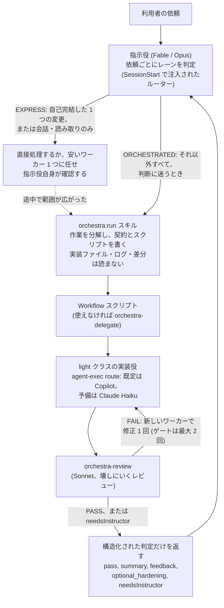

# orchestra

[English](README.md) | 日本語

**コスト階層型のマルチエージェント実行**のための Claude Code プラグインです。高価な指示役モデル(Fable/Opus など)が作業を分解してオーケストレーション用のスクリプトを書き、`agent-exec route` がタスクごとに使える最も安い実装役を選び(既定は Copilot などの外部実行系、予備は Claude Haiku)、Sonnet のレビュー役が結果を壊しにかかって検証し、指示役には構造化された合否の判定だけが返ります。

## なぜ必要か

すべての手順を最も高価なモデルで実行すると、そこまでの能力が要らない作業にも費用がかかります。`orchestra` は PoC で確かめた進め方を形にしたものです。実装は安いモデルに、検証は実装を積極的に壊しにいく中位モデルに任せ、高価な指示役は計画と例外対応以外では作業に関わりません。

## 仕組み



- **2 つのレーン。** `SessionStart` フックがルーターを注入し、指示役は依頼ごとにレーンを判定します。EXPRESS(自己完結した 1 つの変更、または会話・読み取りのみ)は直接処理し、それ以外と判断に迷うものはすべて `orchestra:run` の手順に従います。判定は依頼をまたいで持ち越しません。
- **2 つの実行経路。** Dynamic Workflows(推奨。指示役が `agent()`/`pipeline()` を使う JavaScript を書く。雛形は `skills/run/SKILL.md`)と、Workflows が使えない環境での `orchestra-delegate` によるサブエージェントの入れ子です。
- **2 回のゲート。** レビューのゲート 1 回に、修正 1 回と差分だけを見る再ゲートが続きます。差し戻しには契約の該当箇所の引用が必須で、契約が求めていない改善は `optional_hardening` に回り、合否には影響しません。
- **ワーカーの隔離。** 作業ツリーに未コミットの変更があると、`agent-exec dispatch` はワーカーごとに専用の git worktree を用意します。さらにフックが、サブエージェントによる破壊的な VCS コマンドや、利用者のメインの作業ツリーへの書き込みを止めます。

**どちらの経路でも守るべきルールが 1 つあります**: エージェントを呼び出すときは必ず `model` か `agentType` を明示してください。どちらも省くと、起動されたエージェントはセッションの(高価な)モデルを黙って引き継ぎ、コスト階層化が成り立たなくなります。

## インストール

このプラグインは `yacchi-plugins` マーケットプレイスで配布しています:

```text
/plugin marketplace add yacchi/claude-plugins
/plugin install orchestra@yacchi-plugins
```

ローカルで開発する場合は、マーケットプレイスのリポジトリのルートをローカルのマーケットプレイスとして追加します:

```text
/plugin marketplace add ./
/plugin install orchestra@yacchi-plugins
```

配布前にマーケットプレイスのリポジトリのルートで検証します:

```bash
claude plugin validate .
```

## 使い方

インストールすると、Opus/Fable のセッションではルーターが自動で有効になります(Sonnet/Haiku のセッションには何も注入しません)。手順を明示的に呼び出す場合:

```text
/run
```

コスト階層型の委譲が向いている作業を説明するだけでも、Claude がスキルを自動で呼び出します。手順の中で指示役は次のことを行います:

1. 作業を分解し、タスクごとの契約(文字どおりの仕様、検出すべき誤り、検証コマンド)を定める。
2. 各タスクを light クラスの実装役 → `orchestra-review` → 最大 1 回の修正と再ゲート、と流す Workflow スクリプトを書く(または再利用する)。設計の裁量があるタスクは `orchestra-deep`(Opus)に回す。
3. 生のログや差分、途中の成果物は受け取らず、構造化された判定だけを受け取る。

付属のスキル:

| スキル | 用途 |
|---|---|
| `/setup` (`orchestra:setup`) | Codex/Copilot の有無を調べ、対話形式で `orchestra.yaml` を書く |
| `/cleanup` (`orchestra:cleanup`) | リポジトリに残った orchestra の worktree とブランチを片付ける |
| `orchestra:ui` | ローカルのダッシュボード(`agent-exec ui --open`)を開く。wave、worktree、dispatch、使用量をリアルタイムに表示し、トークンは消費しない |

## 設定

設定は 4 つの層を後勝ちで深くマージします: 組み込みの既定値 ← `~/.claude/orchestra.yaml` ← `.claude/orchestra.yaml` ← `.claude/orchestra.local.yaml`。プロジェクトの設定ファイルには変えたいキーだけを書けば足ります。マージ結果は `agent-exec config` で確認できます。

- **`tiers`** — クラス/役割(`light`、`standard`、`deep`、`review`)ごとの Claude のモデル。振り分け先が `claude` になったときに使われます。
- **`external_executors`** — Codex、Copilot、opencode などを実装役やレビュー役として使います。既定で有効ですが、実際に使えるかどうかで選別されるため、どちらの CLI も入っていなければすべて `claude` に振り分けられます。推奨は同梱の `agent-exec` ラッパー(`agent-exec install`)と、`Bash(agent-exec:*)` の許可ルール 1 つです。
- **`priority`** — クラス/役割ごとの実行系の優先順。順に候補をたどる処理は `agent-exec route` / `agent-exec dispatch` が行い、指示役が手作業でたどることはありません。
- **`enforcement.*`** — フックによる防護(`worker_vcs`、`worker_tree`、`worktree_lease`、`session_cleanup`、`turn_edits`、`opus_generalist`、オプトインの `light_class`)。どれにも回避用のマーカーと、環境変数による無効化スイッチがあります。

コメント付きの全項目は [`examples/orchestra.yaml`](examples/orchestra.yaml) を、マージの手順と各オプションは [`skills/run/references/config.md`](skills/run/references/config.md) を参照してください。`/setup` を使えばファイルを代わりに編集してくれます。

## 構成

| パス | 役割 |
|---|---|
| `agents/orchestra-light.md` | 機械的な実装を担うワーカー(Haiku) |
| `agents/orchestra-deep.md` | 設計判断を伴う実装を担うワーカー(Opus) |
| `agents/orchestra-review.md` | 使い捨ての probe で壊しにいくレビュー役。契約を引用した厳格な判定を返す(Sonnet) |
| `agents/orchestra-delegate.md` | Workflows が使えない環境での中間管理役(Sonnet) |
| `skills/run/` | 手順書本体と、必要なときに読む参考資料(`authoring`、`gates`、`isolation`、`config`、`programme`、`external-executors`、`poc-findings`) |
| `skills/setup/`、`skills/cleanup/`、`skills/ui/` | 付属のスキル |
| `tools/agent_exec.py` | `agent-exec` CLI: route、dispatch、isolate、shelf、wave、ui、telemetry など |
| `hooks/` | ルーターの注入と再通知、ターン規模の検知、ワーカーの VCS・作業ツリー・lease の防護、Opus 汎用サブエージェントへの通知、worktree の後片付け |
| `examples/orchestra.yaml` | 設定のサンプル |

ファイルごとの詳細: [`docs/components.md`](docs/components.md)

## 関連資料

`docs/` 配下は英語、`feedback/` は日本語です。

- [`docs/design-notes.md`](docs/design-notes.md) — ゲート、worktree による隔離、stash の代替、worktree の lease がなぜあるのか、それぞれのきっかけになった事象
- [`docs/components.md`](docs/components.md) — エージェント、スキル、ツール、フックそれぞれの詳しい役割
- [`docs/poc.md`](docs/poc.md) — PoC の測定結果と外部実行系のモデル比較
- [`feedback/`](feedback/) — 日付ごとの利用状況の振り返り
