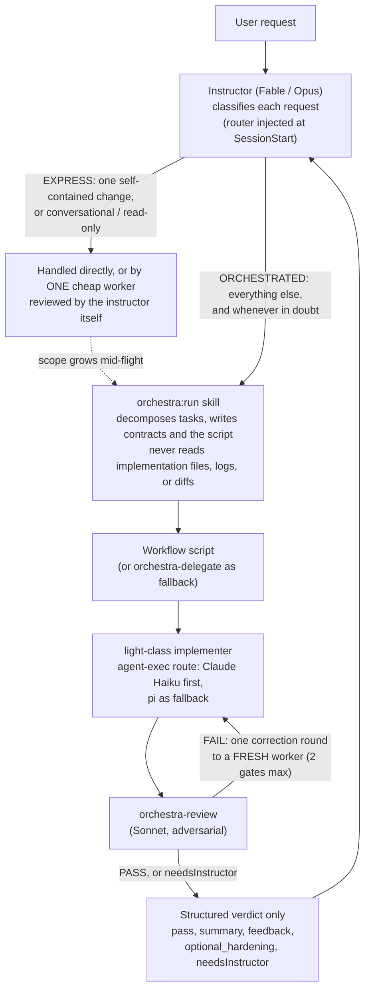

# orchestra

English | [日本語](README.ja.md)

A Claude Code plugin for **cost-tiered multi-agent orchestration**: an expensive instructor model (e.g. Fable/Opus) decomposes work and writes orchestration scripts, `agent-exec route` picks the cheapest ready implementer for each task (Claude Haiku for light work, an external executor such as pi or Codex for standard / independent-review work), Sonnet reviewers adversarially check the result, and only structured pass/fail verdicts flow back up.

## Why

Running every step of a task on your most expensive model wastes money on work that doesn't need it. `orchestra` codifies a pattern validated by a proof of concept: route implementation to a cheap model, route verification to a mid-tier model that actively tries to break the implementation, and keep the expensive instructor model out of the loop entirely except for planning and exception handling.

## How it works



- **Two lanes.** A `SessionStart` hook injects a router that makes the instructor classify every request. EXPRESS (one self-contained change, or conversational/read-only) is handled directly; everything else — and anything in doubt — goes through the `orchestra:run` playbook. Lane choices never persist across requests.
- **Two execution paths.** Dynamic Workflows (preferred: the instructor writes a JavaScript script with `agent()`/`pipeline()`, template in `skills/run/SKILL.md`), or nested subagents via `orchestra-delegate` when Workflows are unavailable.
- **Two gates.** One review gate plus at most one correction round and an incremental re-gate. A rejection must cite the contract; non-required improvements go to `optional_hardening` and never block.
- **Isolated workers.** When the working tree holds uncommitted work, `agent-exec dispatch` gives each worker its own git worktree, and hooks keep subagents from running destructive VCS commands or writing into your main tree.
- **Sandbox and learned grants.** CLI workers use the OS sandbox by default; cache denials may be learned, while other denials return `needsPermission` for instructor approval via `agent-exec sandbox allow`.
- **Watchdog.** Wall, idle, and repeated-tool-call limits stop runaway workers and return a structured correction/escalation signal.

**The one rule that matters in both paths**: every agent invocation must explicitly set `model` or `agentType`. Omitting both causes the spawned agent to silently inherit the session's (expensive) model, which defeats the entire cost-tiering strategy.

## Installation

This plugin is distributed as part of the `yacchi-plugins` marketplace:

```text
/plugin marketplace add yacchi/claude-plugins
/plugin install orchestra@yacchi-plugins
```

For local development, add the marketplace repository root as a local marketplace instead:

```text
/plugin marketplace add ./
/plugin install orchestra@yacchi-plugins
```

Validate from the marketplace repository root before distributing:

```bash
claude plugin validate .
```

## Usage

Once installed, the router activates on its own in Opus/Fable sessions (Sonnet/Haiku sessions get nothing injected). To invoke the playbook explicitly:

```text
/run
```

Or just describe a task that needs cost-tiered delegation — Claude can invoke the skill automatically. The playbook has the instructor:

1. Decompose the task and define per-task contracts (literal spec, the mistakes to detect, a verification command).
2. Write (or reuse) a Workflow script that pipelines each task through a light-class implementer → `orchestra-review` → at most one correction round and re-gate. Design-latitude tasks go to `orchestra-deep` (Opus) instead.
3. Receive only structured verdicts, never raw logs, diffs, or intermediate files.

Companion skills:

| Skill | Purpose |
|---|---|
| `/setup` (`orchestra:setup`) | Detect Codex/pi and write `orchestra.yaml` interactively |
| `/cleanup` (`orchestra:cleanup`) | Reclaim leftover orchestra worktrees and branches in the repository |
| `orchestra:ui` | Open the local dashboard (`agent-exec ui --open`): waves, worktrees, dispatches, usage — live, no tokens spent |

## Configuration

Config is deep-merged from four layers (later wins): built-in defaults ← `~/.claude/orchestra.yaml` ← `.claude/orchestra.yaml` ← `.claude/orchestra.local.yaml`. A project file only needs the keys it changes. `agent-exec config` prints the merged result.

- **`tiers`** — Claude models per class/role (`light`, `standard`, `deep`, `review`), used whenever routing resolves to `claude`.
- **`external_executors`** — Codex, pi, … as implementers or reviewers. Enabled by default but gated on real availability; with neither CLI installed, everything resolves to `claude`. The recommended setup is the bundled `agent-exec` wrapper (`agent-exec install`) plus one `Bash(agent-exec:*)` allow rule.
- **`priority`** — ordered executors per class/role. `agent-exec route` / `agent-exec dispatch` perform the walk so the instructor never does it by hand.
- **`enforcement.*`** — the hook guards (`worker_vcs`, `worker_tree`, `worktree_lease`, `session_cleanup`, `turn_edits`, `opus_generalist`, opt-in `light_class`). Each has an escape marker and an environment kill switch.

See [`examples/orchestra.yaml`](examples/orchestra.yaml) for the full commented schema and [`skills/run/references/config.md`](skills/run/references/config.md) for the merge algorithm and every option. `/setup` edits the file for you.

### Migrating from Copilot CLI / opencode

In v0.43.0, the Copilot CLI and opencode executors were removed because pi is a faster, lighter path to the same models.
Use pi's `github-copilot/*` provider for Copilot models and `openai-codex/*` for Codex/ChatGPT-subscription models.
Log in to either provider with `/login` inside `pi`, then re-run `orchestra:setup` to remove old configuration keys.

## Components

| Path | Role |
|---|---|
| `agents/orchestra-light.md` | Mechanical implementation worker (Haiku) |
| `agents/orchestra-deep.md` | Design-sensitive implementation worker (Opus) |
| `agents/orchestra-review.md` | Adversarial reviewer with throwaway probes; strict, contract-cited verdict (Sonnet) |
| `agents/orchestra-delegate.md` | Middle manager for environments without Workflows (Sonnet) |
| `skills/run/` | The playbook, plus on-demand references (`authoring`, `gates`, `isolation`, `config`, `programme`, `external-executors`, `poc-findings`) |
| `skills/setup/`, `skills/cleanup/`, `skills/ui/` | Companion skills |
| `tools/agent_exec.py` | The `agent-exec` CLI: route, dispatch, isolate, shelf, wave, ui, telemetry, … |
| `hooks/` | Router injection and reminder, turn-size tripwire, worker VCS/tree/lease guards, Opus-generalist nudge, worktree cleanup |
| `examples/orchestra.yaml` | Sample configuration |

Per-file detail: [`docs/components.md`](docs/components.md).

## Further reading

- [`docs/design-notes.md`](docs/design-notes.md) — why the gates, worktree isolation, stash replacement, and worktree leases exist, and the incidents that led to each
- [`docs/components.md`](docs/components.md) — detailed role of every agent, skill, tool, and hook
- [`docs/poc.md`](docs/poc.md) — PoC measurements and the external-executor model comparison
- [`feedback/`](feedback/) — dated usage reviews
